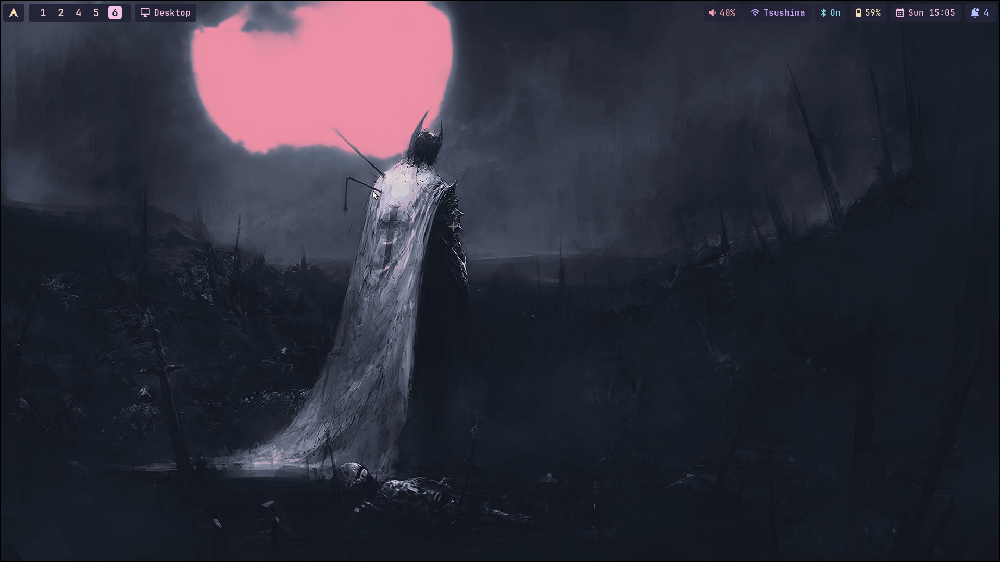
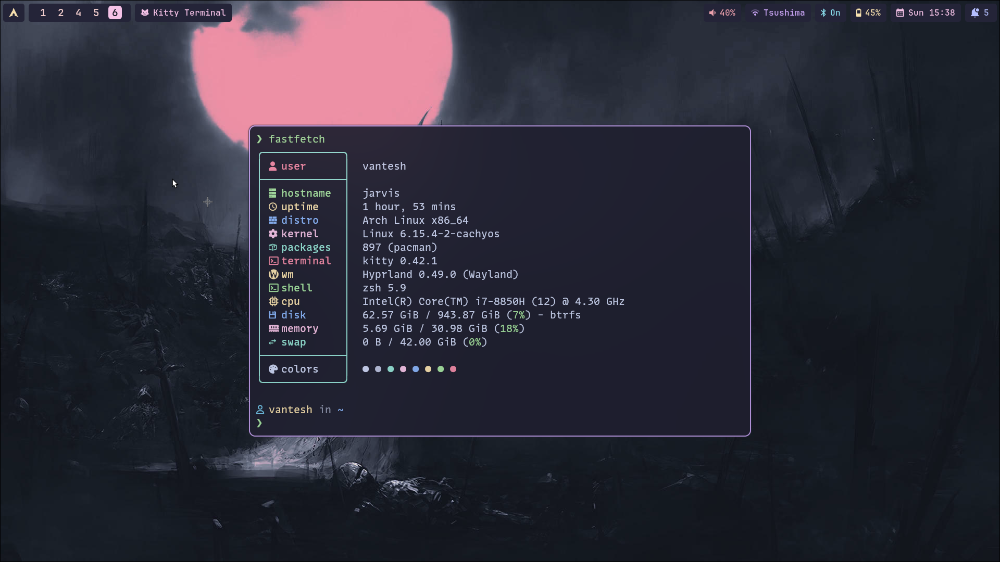
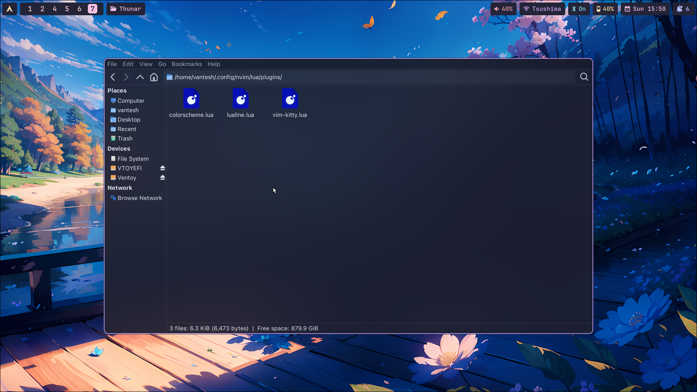
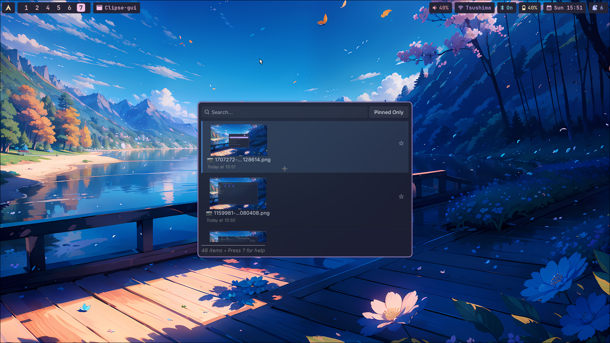
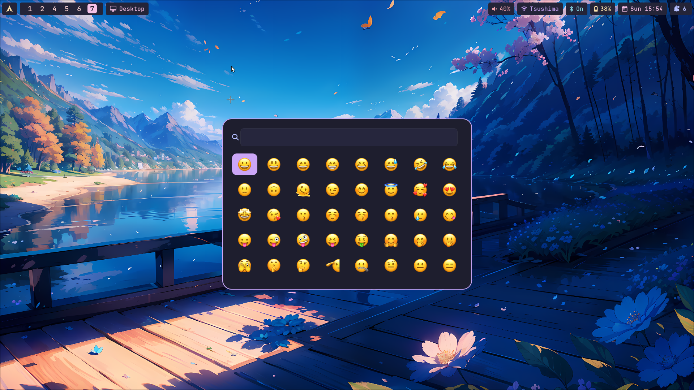
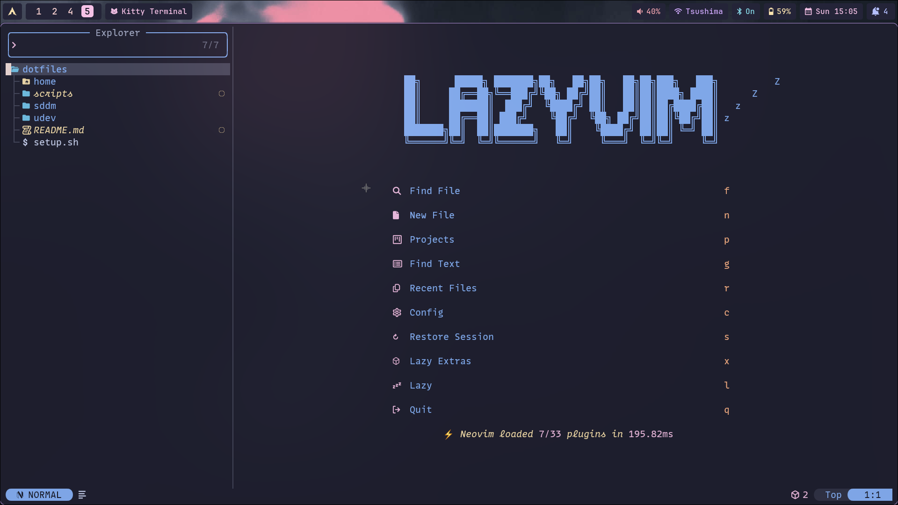

# Hyprland Dotfiles

<div align="left">

<a href="https://github.com/Vantesh/dotfiles/commits/main/"></a>
<a href="https://github.com/Vantesh/dotfiles"></a>

</div>

##

Hyprland dotfiles managed with [chezmoi](https://github.com/twpayne/chezmoi).

## Previews

<details>
<summary>Click to view desktop environment </summary>

### Desktop Screenshots

#### Desktop



#### Lock Screen


#### Rofi Application Launcher


#### Kitty Terminal



#### Thunar File Manager



#### Clipboard Manager



#### Emoji Picker



#### Development Environment




</details>

## Requirements

- **Minimal Arch Linux installation** OR **CachyOS** (not thoroughly tested)
- **Network access** - For downloading packages and dependencies

## Installation

### Method 1: Direct Installation

Initialize and apply the dotfiles directly:

```bash
chezmoi init --apply vantesh
```

### Method 2: Clone and Install

If you prefer to clone the repository first:

```bash
# Clone the dotfiles repository
git clone https://github.com/vantesh/dotfiles.git

# Navigate to the cloned directory
cd dotfiles

# Make the install script executable
chmod +x install.sh

# Run the installation script
./install.sh
```

This method allows you to inspect and modify the configurations before installation.

## Keybindings

Use **SUPER + F2** to view all available keybindings and shortcuts.
Super is the **Windows** key or **Command** key on macOS keyboards.

### Theming & Appearance

- Dynamic theming with **Matugen**
- Apple cursors
- Nerd fonts and emoji support

## What The Script Does

1. **System Configuration** - Configures sudo, pacman, and installs AUR helper
2. **Dependencies** - Installs core packages and GPU drivers
3. **Services** - Configures system services and settings
4. **Theming** - Sets up fonts, cursors, and visual themes
5. **Dotfiles** - Applies configuration files
6. **Shell Setup** - Configures ZSH (optional)
7. **Snapshots** - Sets up Snapper for BTRFS (optional)
8. **Bootloader** - Configures GRUB or limine theme
9. **Laptop Tweaks** - Applies laptop-specific optimizations if detected

## ⚠️ Warning

The script will backup existing configurations where possible, but **make sure to backup important data before running the script**.
