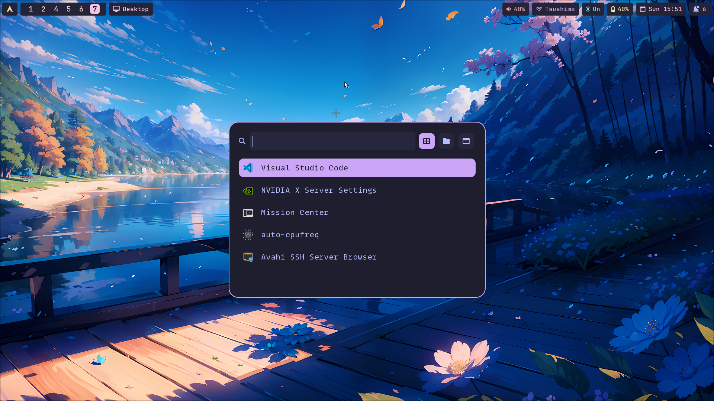
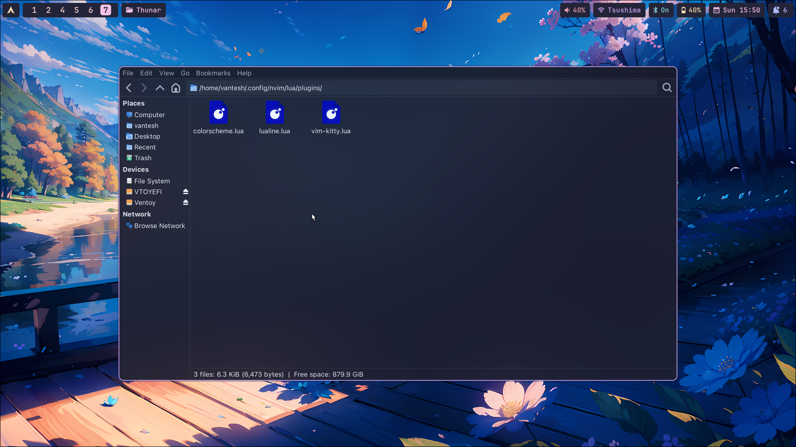
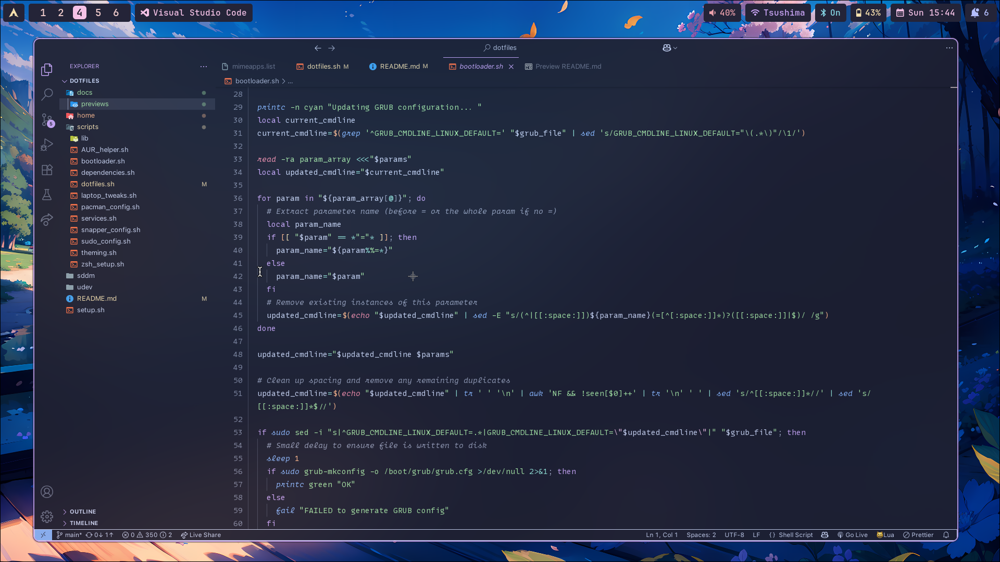

# Hyprland Desktop Environment Setup

Hyprland dotfiles managed using [chezmoi](https://github.com/twpayne/chezmoi).

## Previews

<details>
<summary>Click to view desktop environment </summary>

### Desktop Screenshots

#### Desktop


#### Lock Screen


#### Rofi Application Launcher



#### Kitty Terminal


#### Thunar File Manager



#### Clipboard Manager


#### Emoji Picker


#### Development Environment




</details>

## Requirements

- **Minimal Arch Linux installation** OR **CachyOS** (not thoroughly tested)
- **Network access** - For downloading packages and dependencies

1. Initialize and apply the dotfiles:

```bash
sh -c "$(curl -fsLS get.chezmoi.io)" -- -b "$HOME/.local/bin" init --apply vantesh
```

## Keybindings

Use **SUPER + F2** to view all available keybindings and shortcuts.
Super is the **Windows** key or **Command** key on macOS keyboards.

### Theming & Appearance

- Dynamic theming with **Matugen**
- Apple cursors
- Nerd fonts and emoji support

## What The Script Does

1. **System Configuration** - Configures sudo, pacman, and installs AUR helper
2. **Dependencies** - Installs core packages and GPU drivers
3. **Services** - Configures system services and settings
4. **Theming** - Sets up fonts, cursors, and visual themes
5. **Dotfiles** - Applies configuration files
6. **Shell Setup** - Configures ZSH (optional)
7. **Snapshots** - Sets up Snapper for BTRFS (optional)
8. **Bootloader** - Configures GRUB or limine theme
9. **Laptop Tweaks** - Applies laptop-specific optimizations if detected

## ⚠️ Warning

The script will backup existing configurations where possible, but **make sure to backup important data before running the script**.
